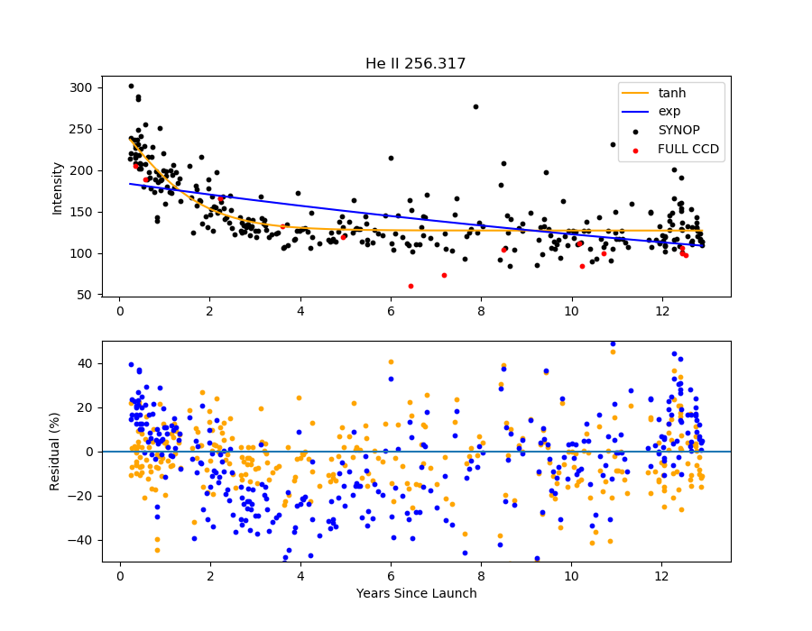

#### 1-ints/

`read_ints_synop.py`: read synop intensities from JTM into data frames.

`read_ints_full_ccd.py`: read QS full CCD intensities into data frames. The list of rasters has
been provied by GDZ. Intensities are computed from raster-averaged spectra.

#### 2-decay/

`calc_decay.py`: read data and fit intensities

```
> python calc_decay.py
 1 He II
 2 Si VII
 3 Fe VIII
 4 Fe X
 Select an option > 1
```

which read the intensities and fits them using both an expoential and tanh model.


